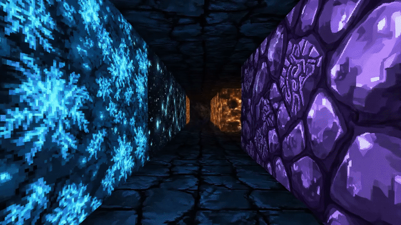

# cub3D: A Journey into 3D Rendering with Ray Casting



## 📖 Table of Contents
- [Introduction](#introduction)
- [Features](#features)
- [How to Use](#how-to-use)
- [Technical Overview: The Rendering Pipeline](#technical-overview-the-rendering-pipeline)
- [Authors](#authors)

## Introduction

Welcome to `cub3D`, a project that explores the fundamentals of 3D graphics by building a "Wolfenstein 3D-like" game engine from the ground up. This endeavor, part of the 1337/42 School curriculum, involves parsing a 2D map and rendering it into an immersive, first-person 3D experience using the ray casting technique.

## Features

### Core Functionality
- **3D Graphics Engine**: Renders a 3D maze from a first-person perspective using ray casting.
- **Texture Mapping**: Applies textures to walls for a more immersive environment.
- **Player Movement**: Full range of movement including forward, backward, and strafing, plus camera rotation.
- **Map Parsing**: Robust parsing of `.cub` files that define the game world.
- **Error Handling**: Graceful management of invalid map configurations.

### Bonus Enhancements
- **Mini-map**: An on-screen display of the player's position and the immediate surroundings.
- **Mouse Control**: Modern camera controls using the mouse for smoother navigation.
- **Wall Collisions**: Prevents the player from walking through walls.

## How to Use

### Prerequisites
- A C compiler (e.g., `cc`, `clang`).
- The `make` utility.
- This project is developed for **macOS** and relies on the `minilibx` (OpenGL version) and AppKit framework.

### Setup & Execution
1. **Clone the repository:**
   ```bash
   git clone https://github.com/elmehdi-elgarouaz/cub3d.git
   cd cub3d
   ```

2. **Build the project:**
   - For the mandatory version:
     ```bash
     make
     ```
   - For the bonus version (includes mini-map and mouse control):
     ```bash
     make bonus
     ```

3. **Launch the game:**
   You must provide a map file from the `Mandatory/maps` or `Bonus/maps` directory as an argument.
   ```bash
   ./cub3D Mandatory/maps/map1.cub
   ```
   For the bonus version:
   ```bash
   ./cub3D_bonus Bonus/maps/map1_bonus.cub
   ```

## Technical Overview: The Rendering Pipeline

The engine's architecture is a classic CPU-GPU collaboration, broken down into three main phases. This graph illustrates the entire process from running the program to rendering a single frame.

```mermaid
graph TD
    subgraph "Phase 1: The Blueprint (CPU-Heavy Parsing)"
        A["User runs './cub3D map.cub'"] --> B{"macOS Kernel"}
        B --> C["dyld (Dynamic Linker) loads program"]
        C --> D["Loads Frameworks (AppKit, OpenGL) into memory"]
        D --> E["main() function begins"]
        E --> F["Parsing functions are called"]
        F -- "Opens & reads the .cub file" --> G["Validate all identifiers and map data"]
        G --> H["Success: a complete 't_game' data struct is created in RAM"]
    end

    subgraph "Phase 2: Sending Materials (CPU -> GPU Hand-off)"
        H --> I["mlx_init() is called"]
        I -- "Uses AppKit to connect to the window server" --> J["mlx_new_window() creates a window on screen"]
        J --> K["mlx_xpm_file_to_image() is called for each texture"]
        K -- "CPU sends pixel data to GPU via OpenGL commands" --> L["Textures are now stored in the GPU's VRAM"]
    end

    subgraph "Phase 3: The Render Loop (The CPU-GPU Dance)"
        L --> M["mlx_loop_hook() registers the main render function"]
        M --> N{"Render Loop Begins"}

        subgraph "One Frame"
            N --> O["Input: Check for key presses (W, A, S, D, Arrows)"]
            O --> P["Update (CPU): ft_move_player() updates player's x, y, and angle in RAM"]
            P --> Q["Calculate (CPU): ft_cast_rays() performs all the math to determine what to draw"]
            Q --> R["Prepare Draw Commands (CPU): ft_draw_all() tells the GPU what color each pixel of the wall slice should be"]
            R --> S["Execute (GPU): The GPU receives commands via OpenGL/Metal and uses its shaders to rapidly draw the entire scene to an off-screen image buffer"]
            S --> T["Display: mlx_put_image_to_window() puts the final, completed image on the screen"]
            T --> N
        end
    end

    style A fill:#D1FAE5,stroke:#065F46
    style H fill:#D1FAE5,stroke:#065F46
    style L fill:#FEF9C3,stroke:#713F12
    style S fill:#DBEAFE,stroke:#1E40AF
    style T fill:#DBEAFE,stroke:#1E40AF
```



At its core, the rendering engine uses a **Digital Differential Analyzer (DDA)** algorithm. For each vertical slice of the screen, a ray is cast from the player's position. The algorithm calculates the distance to the nearest wall by checking for intersections with both horizontal and vertical grid lines. The shortest distance is then used to determine the height of the wall to be drawn on the screen. A key challenge is correcting the "fisheye" effect, where walls can appear curved. This is solved by adjusting the ray's distance using the cosine of the angle relative to the player's view, ensuring a distortion-free projection.


## [Rendering BreakDown Article](https://medium.com/@elmehdielgarouaz/647ff2f7fd4f)


## Authors

This project was brought to life by the collaborative efforts of two passionate developers.

| [<br><sub>Youssef Mazini</sub>](https://github.com/yomazini) | [<br><sub>El Mehdi El Garouaz</sub>](https://github.com/MEHDIJAD/) |
| :---: | :---: |
| [🐙 GitHub](https://github.com/yomazini) <br> [💼 LinkedIn](https://www.linkedin.com/in/youssef-mazini/) | [🐙 GitHub](https://github.com/MEHDIJAD/) <br> [💼 LinkedIn](https://www.linkedin.com/in/el-mehdi-el-garouaz-a028aa287/) |
